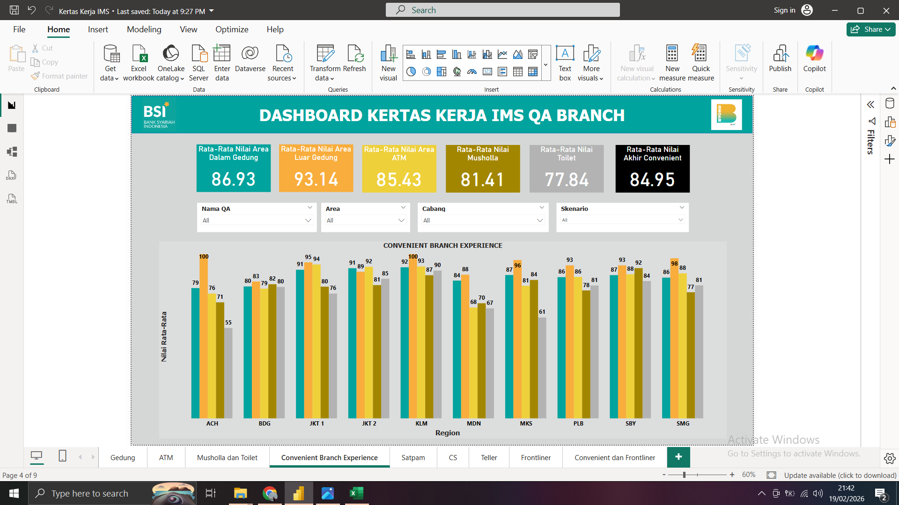
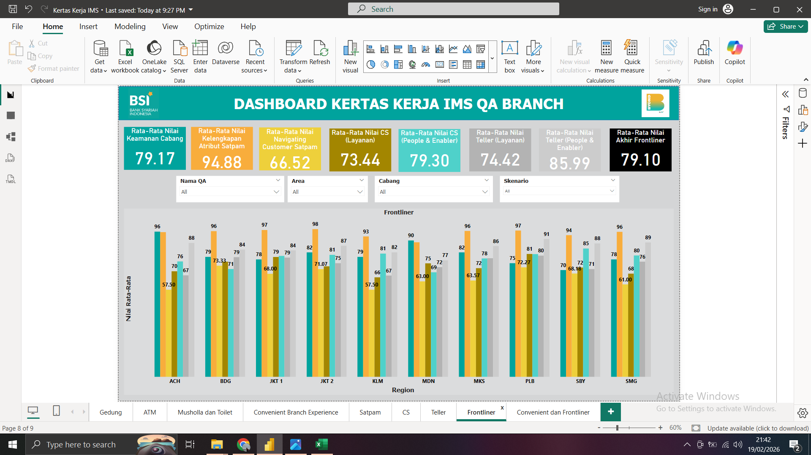
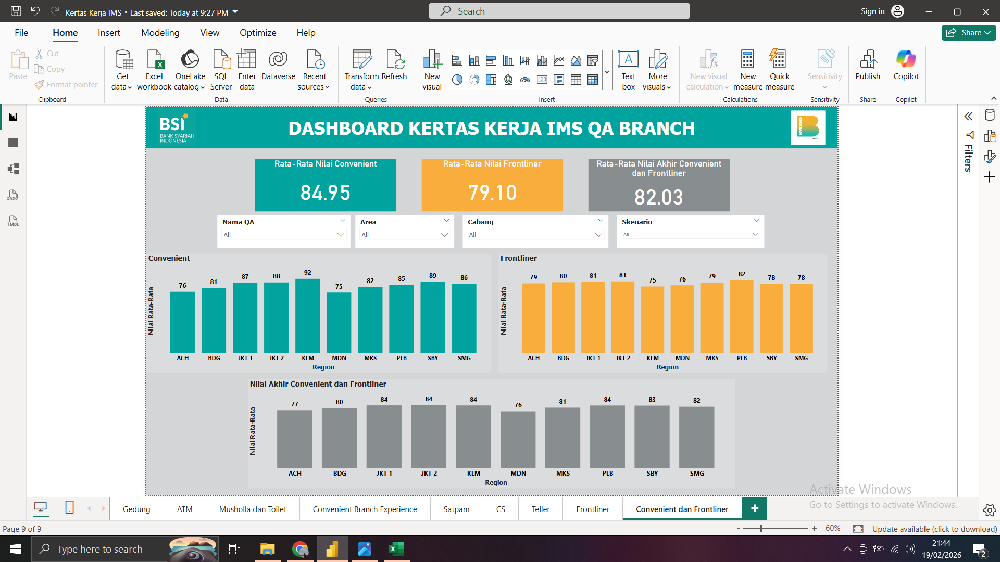

# Dashboard Monitoring Kualitas Layanan Cabang

Proyek ini bertujuan untuk menganalisis performa kualitas layanan cabang di berbagai region dengan mengevaluasi dua dimensi utama:
- Fasilitas Cabang (Convenient Area)
- Kinerja Pelayanan Frontliner
Analisis ini membantu mengidentifikasi cabang dengan performa rendah serta memberikan rekomendasi berbasis data untuk peningkatan operasional.
---

## Latar Belakang Masalah
Manajemen membutuhkan evaluasi terstruktur terhadap kualitas operasional cabang untuk:
- Mengidentifikasi cabang dengan skor layanan rendah
- Membandingkan performa fasilitas dan pelayanan
- Menemukan gap operasional antar region
- Mendukung pengambilan keputusan berbasis data
---

## Tools yang Digunakan
- Microsoft Excel (Data Cleaning & Preparation)
- Power BI Desktop (Data Modeling & Visualisasi)
---

## Proses Pengolahan Data
- Membersihkan data (mengatasi inkonsistensi & formatting)
- Mengelompokkan dimensi penilaian (Fasilitas vs Frontliner)
- Menghitung rata-rata nilai per cabang & region
- Membuat measure untuk menghitung skor akhir performa
---

# Visualisasi Dashboard

## 1. Performa Fasilitas Cabang

### Temuan Utama
- Area Toilet memiliki rata-rata skor terendah (77.84)
- Beberapa region menunjukkan performa fasilitas yang konsisten lebih rendah
### Insight Bisnis
Kualitas fasilitas berpengaruh langsung terhadap kenyamanan dan persepsi nasabah terhadap cabang.
---

## 2. Performa Pelayanan Frontliner

### Temuan Utama
- Atribut Navigating Customer memiliki skor terendah
- Terdapat variasi performa antar region yang cukup signifikan
### Insight Bisnis
Ketidakkonsistenan pelayanan mengindikasikan perlunya standarisasi pelatihan frontliner.
---

## 3. Analisis Gabungan Per Region

### Temuan Utama
- Beberapa region menunjukkan gap antara fasilitas dan pelayanan
- Terutama pada Region Kalimanan yang memiliki gap paling jauh antara fasilitas dan pelayanan
- Skor akhir mengindikasikan ketidakseimbangan operasional
### Rekomendasi
- Prioritaskan cabang dengan skor gabungan terendah
- Lakukan program peningkatan terfokus sesuai dimensi yang lemah
- Monitoring evaluasi dilakukan secara berkala
---

##  Dampak Proyek
Dashboard ini membantu manajemen untuk:
- Memantau performa cabang secara efisien
- Mengidentifikasi gap layanan dengan cepat
- Mendukung pengambilan keputusan berbasis data
---

## Author
Muhamad Hadzami  
Aspiring Data Analyst
